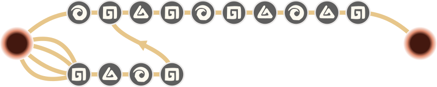
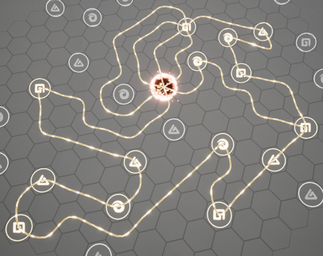

# KungfuMeridians
A python script to optimize the Meridian layout in the game The Matchless Kung-Fu

## How to use
Download the script SuperstringMeridianMCMC.py to your local system. 
You will need a python environment with the package `networkx` installed.

Scroll down to the comment saying "User-Customizable Block" to configure 
your setup. In the lists of Inner Kung-Fu arts, comment out the lines for 
all arts you don't have or don't want.

Below, if you wish to not reduce the elemental Chi arts down to the minimum
providing you with the maximal elemental bonus, replace the function calls
of minimal_set() with total_set() for the desired elements.

Run the script, taking into account it might take a moment for large sets,
then consult the read-out. If there's too many or too few of the meridian
nodes in use, experiment with adding or removing some arts from the total 
set.

As the method used is random-number based, running the script again might
result in a different layout. For large sets of Inner Kung-Fu, it might
be worth increasing the amount of attempts (line 449) to get a more reliably
optimal solution.

## How to read the result
Below the statistics for the discovered layout, you will find the layout
itself as a series of lines. These are to be read as follows:
1. The symbols ⟁⧈⭗ are the Meridian nodes themselves. Read it from left
to right and connect the meridian to these nodes in that order. Each line 
is a Meridian starting from the center.
2. A digit means that meridians connect at this point: The Meridians
that end with that digit needs to be connected to the symbol *following*
the digit in the other Meridian
3. The Meridian that doesn't end in a digit needs to return to the center
after its last symbol
4. If there's fewer than five Meridians, one will be marked with a star (*).
This marks the longest Meridian, and all free sides of the center should
be connected to its first symbol as well to maximize the bonuses.

### Example

Readout as follows:

    ⭗1⧈⟁⧈⭗⧈⟁⭗⟁⧈
    *⧈⟁⭗⧈1

This means we have two Meridians. The first goes out from the core and back,
while the second covers four symbols, then joins the first Meridian on the
⧈ that comes after the 1. As the * is on the second line, all the other
possible Meridians just connect to the first ⧈ of that second line.

Laid out neatly left to right, it looks like this:

In the game, the Meridians will be less orderly as they need to twist
around to reach the symbols:

## How to Help

The list of Inner Kung-Fu is not yet complete. Please help me complete the
list by adding the ones you have unlocked, and creating a pull request.

If you speak Chinese, I'd love to have bilingual versions of the Inner
Kung-Fu names and the statistics readout at least, if not even a Chinese 
version of this ReadMe file.

Any corrections or optimizations are of course also welcome.